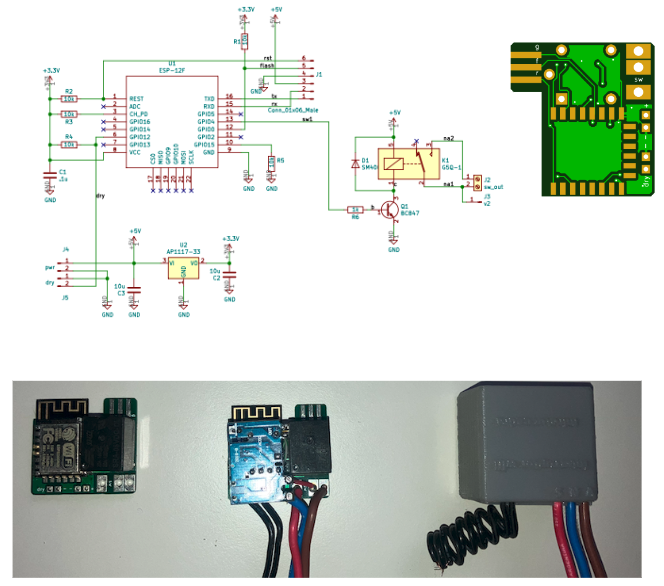
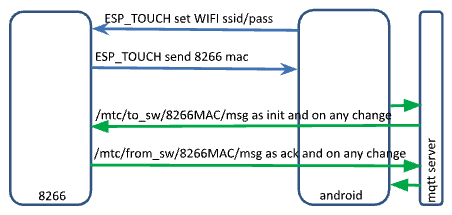
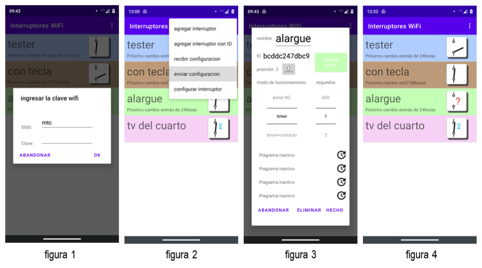

<!-- You have some errors, warnings, or alerts. If you are using reckless mode, turn it off to see inline alerts.
* ERRORs: 0
* WARNINGs: 0
* ALERTS: 6 -->

>>>>>  gd2md-html alert:  ERRORs: 0; WARNINGs: 0; ALERTS: 6.

<ul style="color: red; font-weight: bold"><li>See top comment block for details on ERRORs and WARNINGs. <li>In the converted Markdown or HTML, search for inline alerts that start with >>>>>  gd2md-html alert:  for specific instances that need correction.</ul>

Links to alert messages:
<a href="#gdcalert1">alert1</a>
<a href="#gdcalert2">alert2</a>
<a href="#gdcalert3">alert3</a>
<a href="#gdcalert4">alert4</a>
<a href="#gdcalert5">alert5</a>
<a href="#gdcalert6">alert6</a>

>>>>> PLEASE check and correct alert issues and delete this message and the inline alerts.

# 

>>>>>  gd2md-html alert: inline image link here (to images/image1.png). Store image on your image server and adjust path/filename/extension if necessary.  (<a href="#">Back to top</a>)(<a href="#gdcalert2">Next alert</a>) >>>>> 

WiFi Switch

## Objetivo

Desarrollo  integral de interruptores comandados desde Internet. Esto involucro el diseno del hardware, el programa en C para el microcontrolador utilizado, 8266 de Espressif, y el desarrollo de la aplicacion para movil tanto Android, escrita en Kotlin como IOS escrita en SwiftUI.

## Hardware

Consiste en lo que necesita el modulo 8266 para operar, esto es un regulador de 3,3V, un rele de 6A con aislacion para 220VAC, una fuente de 220Vac a 5Vdc de unos 200mA lo mas pequena posible

>>>>>  gd2md-html alert: inline image link here (to images/image2.png). Store image on your image server and adjust path/filename/extension if necessary.  (<a href="#">Back to top</a>)(<a href="#gdcalert3">Next alert</a>) >>>>> 

>>>>>  gd2md-html alert: inline image link here (to images/image3.png). Store image on your image server and adjust path/filename/extension if necessary.  (<a href="#">Back to top</a>)(<a href="#gdcalert4">Next alert</a>) >>>>> 

## Software

El desarrollo se basa en el uso del protocolo MQTT para enviarle ordenes desde el movil al interruptor conectado a una red Wifi, tambien se configura el nombre, modo de funcionamiento, timers y umbrales. Además desde la app movil con el movil conectado a la red wifi a la que se conectará el interruptor se le envia el password utilizando el protocolo esp-touch desarrollado por Espressif.

### Esquema de operacion

>>>>>  gd2md-html alert: inline image link here (to images/image4.png). Store image on your image server and adjust path/filename/extension if necessary.  (<a href="#">Back to top</a>)(<a href="#gdcalert5">Next alert</a>) >>>>> 

Los topicos mqtt son : hacia el interruptor = /mtc/to_sw/8266 MAC address/ y desde el interruptor =  /mtc/from_sw/8266 MAC address/ y el mensage es un string Json que contiene siempre la misma estructura e informacion =

{"name":"velador","mode":0,"secs":0,"state":"on","prgs":[{"days":0,"start":0,"stop":0},{"days":0,"start":0,"stop":0},{"days":0,"start":0,"stop":0},{"days":0,"start":0,"stop":0}],"tempX10":0}

Donde:

name: string up to 32 char

mode:	timer		0

	timer/cont	1		

	pulse na	2		

	pulse nc	3		

	timer/temp	4		

	temp		5		

secs: seconds as auxiliary info for pulse mode

tempX10: temperatura x 10 (solo sw doble)

days:	bit0= domingo, bit1 = lunes... bit6 = sabado

start:	minutes from 0 hs to sw on

stop:	minutes from 0 hs to sw off

state:	off		0

	on		1		

	get_data	2		

	set_data	3		

	erase		4		

	upgrade	5		

	server fail	6		

	upgrade fail	7		

	upgraded	8	

### Programa C

El desarrollo del programa C para el microcontrolador tiene las siguientes funciones:

1. Dialogo mqtt con la app de acuerdo al esquema de operación de arriba.
2. Recibir de la app los datos de configuraci’on: nombre, modo y timers y guardarlos en memoria no volatil para que estenn disponibles para todos los usuarios.
3. Manejar el protocolo esp-touch para la coneccion inicial a una red wifi y volverloa utilizar si no se logra conectar a la red inicial.
4. Manejar el on board led de la placa 8266 para informar el estado del hardware. Ver Especificaciones.
5. Recibir actualizaciones de firmware, versiones de este programa C, mediante el mecanismo OTA “ over the air” de Espressif.

### Procedimiento para cargar nuevo firmware “upgrade”.

1. Desde la plataforma ESP8266-RTOS-SDK con la que se escribe y compila el programa, generar el nuevo firmware con el comando:

        _make ota_

2. Renombrar el archivo que se generará en el directorio build  “switch_control_c.ota.bin” por “switch_control.ota”:

        _cd build_

        _rm switch_control.ota_

        _mv switch_control_c.ota.bin switch_control.ota_

3. Prender un servidor HTTP en el mismo directorio en el que está el archivo renombrado y prender el servidor escuchando al puerto XX:

        _python -m http.server XX_

4. En la App android abrir la configuración del interruptor a realizarle la carga, ir a "mantenimiento" y luego "firmware upgrade". Se abrirá una ventana que invita a cargar la dirección IP (la de la máquina en la que se está desarrollando) y el puerto (XX).

Si  el procedimiento es exitoso, el interruptor se levanta solo con el nuevo firmware y sale un cartel informándolo, sinó, en la App tendremos algo más de información respecto a que falló.

### Aplicacion para Android

Con esta app podes operar: es decir prender y apagar las llaves, configurarles la red wifi a la que se conectaran, el modo de uso, hasta 4 timers, el nombre del interruptor, el color y posicion de la pantalla en la que aparece cada interruptor agregado, hacerles firmware upgrade, borrarlo de la app y dejarlo de fabrica. Tambien desde la app incorporas nuevos interruptores ya configurados por terceros.

El desarrollo esta hecho en Kotlin utilizando el patron MVVM, pantallas con Jetpack Compose, corrutinas e inyeccion de dependencias con Dagger Hilt.

### Android App upload to Google Play procedure

To upgrade the Android market version do the following:

1. In Studio Project, clone the current anemometer project from Bitbucket.
2. Upgrade the project and test all new features locally
3. In the file “build. gradle (: app)”, increase the Version Code and Version Name by one. Google requires this to upload an upgrade
4. Upgrade the below version history table
5. Generate a new Signed Bundle: Build / Android AppBundle / Next
6. Module: anemometer.app, Key store path: C:\repos\private_key.pepk, Key store password: xxx, Key alias: xxx, Key password: xxx, mark: Export encrypted….., Next
7. Build Variants: release, Finish
8. Open the Google Console, e-lanita/Production/launch the new version
9. Upload the file app-release.aab from C:\repos\anemometer\app\release

It will take about 2 days to be available in Google Play.

<table>
  <tr>
   <td><strong>vercion</strong>
   </td>
   <td><strong>fecha</strong>
   </td>
   <td><strong>modificacion</strong>
   </td>
   <td><strong>commit</strong>
   </td>
  </tr>
  <tr>
   <td>4(1,4)
   </td>
   <td>

10/07/2021

   </td>
   <td>colores
   </td>
   <td>
   </td>
  </tr>
  <tr>
   <td>5(1.5)
   </td>
   <td>

13/07/2021

   </td>
   <td>icono
   </td>
   <td>
   </td>
  </tr>
  <tr>
   <td>6(1.6)
   </td>
   <td>

5/09/2021

   </td>
   <td>se agregaron modos pulse y reaccion a tecla
   </td>
   <td>
   </td>
  </tr>
  <tr>
   <td>7(1.7)
   </td>
   <td>

22/09/2021

   </td>
   <td>varias mejoras de performance, me pase a linode
   </td>
   <td>
   </td>
  </tr>
  <tr>
   <td>8(1.8)
   </td>
   <td>

27/09/2021

   </td>
   <td>se colgaba al iniciar
   </td>
   <td>
   </td>
  </tr>
  <tr>
   <td>9(1.9)
   </td>
   <td>

27/08/2022

   </td>
   <td>se puede pasar toda la config a otro telefono. Reconoce sw simples
   </td>
   <td>
   </td>
  </tr>
  <tr>
   <td>10(1.10)
   </td>
   <td>

6/11/2022

   </td>
   <td>primera version con ESP_Touch
   </td>
   <td>
   </td>
  </tr>
  <tr>
   <td>11(1.11)
   </td>
   <td>

18/11/2022

   </td>
   <td>OTA y switches dobles
   </td>
   <td>
   </td>
  </tr>
  <tr>
   <td>12(1.12)
   </td>
   <td>

25/11/2022

   </td>
   <td>clean up config multiple
   </td>
   <td>65100d6
   </td>
  </tr>
  <tr>
   <td>13(1,13)
   </td>
   <td>

7/12/2022

   </td>
   <td>niveles de config. Help, timers de + de 24h
   </td>
   <td>f004291
   </td>
  </tr>
  <tr>
   <td>14(1.14)
   </td>
   <td>

31/08/2023

   </td>
   <td>AP1 34, PORQUE LO PIDE GOOGLE
   </td>
   <td>20eec408
   </td>
  </tr>
  <tr>
   <td>15(1.15)
   </td>
   <td>

12/05/2024

   </td>
   <td>Kotlin + JetPackCompose
   </td>
   <td>d29f0ae
   </td>
  </tr>
  <tr>
   <td>16(1.16)
   </td>
   <td>

9/06/2024

   </td>
   <td>MVVM, Dagger-Hilt
   </td>
   <td>dd1f5813
   </td>
  </tr>
  <tr>
   <td>
   </td>
   <td>
   </td>
   <td>
   </td>
   <td>
   </td>
  </tr>
  <tr>
   <td>
   </td>
   <td>
   </td>
   <td>
   </td>
   <td>
   </td>
  </tr>
</table>

### Aplicacion para IOS

La aplicacion para Iphone tiene todas las facilidades de la Android menos la integracion del manejo del protocolo esp-touch que debe utilizarse como una aplicacion aparte. Espressif brinda las librerias para IOS pero en ObjectiveC y no para SwifttUI, aun no he podido “traducirlas” para utilizarlas. Por lo demás tambien se utiliza el patron MVVM y las ventajas de la programacion declarativa propuesta por Apple.

# Operacion del producto terminado

Encendés y apagás (cerrás y abrís) un interruptor desde tu móvil. Podés programarle horarios, días de la semana y un contacto externo (NA), como por ejemplo un detector de lluvia. Tiene un modo pulso (NA o NC de 1 seg. a 10 min.) para, por ejemplo: apertura de portones y disparo de sirenas. Viene configurado de fábrica para que funcione cuando detecte cambios en la entrada de contactos, de forma tal que se puede conectar a una tecla de luz existente y comandarla en forma manual.

La configuración inicial (asociación a una red Wifi), la programación (modos/timers) y la operación (encender/apagar) se hacen con la App Android “Interruptores Wifi” disponible en Google Play. Desde esta App podés operar todos los interruptores que quieras y cada interruptor puede ser operado por varios usuarios que tengan la aplicación instalada y el interruptor agregado.

Podes prender y apagar un interruptor, tocando su icono. El icono muestra el estado real de cada interruptor, los interruptores programados como pulso tienen un reloj de arena y si algún dispositivo no está disponible por falta de conectividad, te lo mostrará con un sigo “?”, figura 4

>>>>>  gd2md-html alert: inline image link here (to images/image5.png). Store image on your image server and adjust path/filename/extension if necessary.  (<a href="#">Back to top</a>)(<a href="#gdcalert6">Next alert</a>) >>>>> 

## Configuración

a) Configurarlo para operarlo desde tu móvil: Desde la pantalla inicial o desde el menú elegis: agregar interruptor. El interruptor nuevo se configura con tu móvil conectado a la red Wifi a la que lo asociarás. La App te mostrará la red  (ssid) y debes escribir la clave, figura 1. Luego si la clave es correcta, el interruptor está accesible y no configurado previamente, pasarás a la pantalla de configuración, en la que tendrás que definirle: nombre, modo de operación, tiempo de respuesta si es modo pulso, color de fondo y posición relativa. En el ejemplo, figura 3, el nombre es “alargue” y el modo es “timers”.

b) Incorporar a tu móvil un interruptor existente: La opción agregar interruptor con ID de la pantalla inicial o del menú te pedirá un ID válido que te puede dar quien haya configurado el interruptor siguiendo el punto anterior. El ID de ese interruptor se ve debajo del nombre en la pantalla de configuración, figura 3.

c) Replicar todos los interruptores de un móvil a otro: La opción recibir configuración de la pantalla inicial o del menú te mostrará un ID que deberás copiar en el móvil en el que ya están configurados los interruptores, en la opción del menú enviar configuración. Si ambos móviles tienen conectividad quedarán idénticamente configurados. Las modificaciones posteriores en un móvil no afectan al otro.

En cualquier momento podés agregar o eliminar interruptores, modificar el nombre, modo de operación, color de fondo, posición relativa y los días y horarios de operación de cada interruptor, yendo a las opciones del menú. Si quedó configurado con una red Wifi inalcanzable, lo rescatás siguiendo los pasos detallados en a).

## Instalación

Para comandar un tomacorriente o una luminaria, el interruptor wifi puede ser instalado dentro de la caja estandar  de 100 x 50 mm existente. A continuación los esquemas respectivos.

>>>>>  gd2md-html alert: inline image link here (to images/image6.png). Store image on your image server and adjust path/filename/extension if necessary.  (<a href="#">Back to top</a>)(<a href="#gdcalert7">Next alert</a>) >>>>> 

## Especificaciones

Dimensiones 33 x 32 x 21 mm

Tensión de entrada 100 a 230 Vac

Carga máxima 6A

Wifi 802.11 b/g/n

Indicacion de estado mediante led azul incorporado. Repite patrones según tabla: 1 = 100mseg prendido y 0 apagado.

## Futuros releases

1. Reemplazar la fuente de switching de 220Vac a 5Vdc por algo mas chico barato e integrado
2. Reemplazar el rel por uno de estado solido para disminuirle el tamaño.
3. Hacerlo compatible con Alexa y con Google home.
4. Integrara esp-touch a la app en IOS como ya esta hecho en Android.